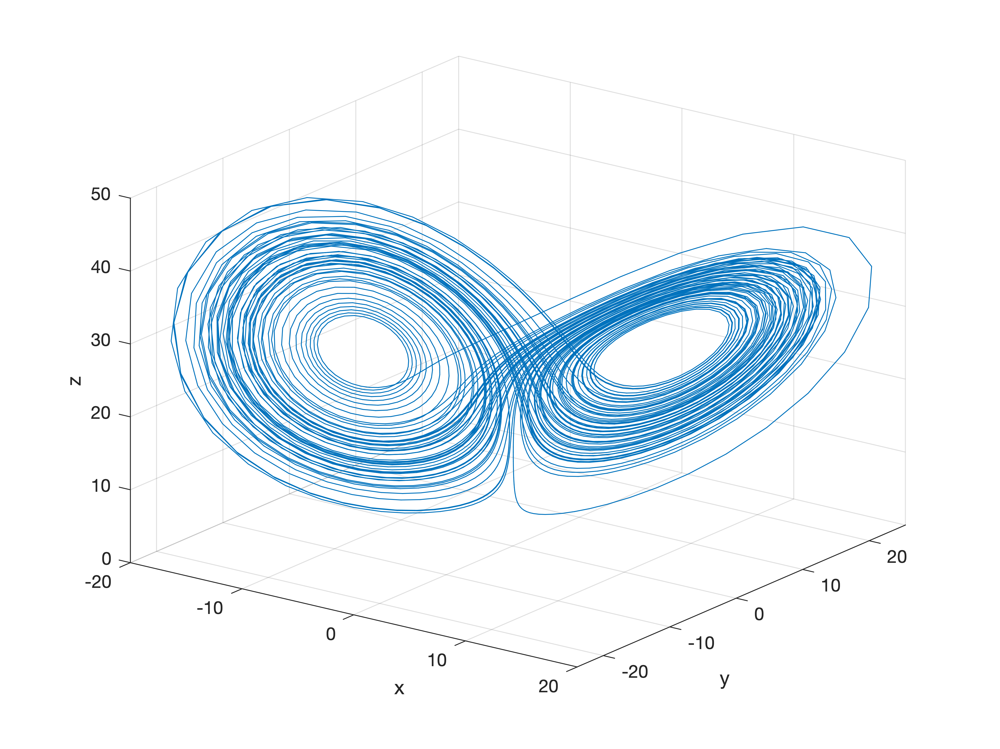

# Data assimilation Project: Experiments with the Lorenz-63 Model
**Online community**: 

Author: Da,Cheng     Email: cda@umd.edu

## Goal of this project
This project will provide readers hand-on experience working on several state-of-the-art data assimliation methods using the 3-variable Lorenz-63 model. Readers will conduct numerical experiments about:
- Get familiar with the Lorenz 63 model (Part A)
- Effects of data assimliation for chaotic systems (Part B)
- 3D-Variational(3D-Var) & Incremental 4D-Variational (4D-Var) methods (Part B)
- Ensemble method (perturbed-observation EnKF & LETKF, Part C)
- Hybrid-gain method (Part D)
- how information is transfered in a DA system (Part E)

Several experiments are suggested to each part so that students can understand the impacts of key parameters for diferent DA methods. 

Our goal is to try our best to give the readers an intuitive understanding about the performance of different DA methods, even if they haven't fully understand the related equations yet. 

Technicaly, no `makefile` or `cmake` is used here so that students shall not be distracted from other techinical complexitities. 

## Instructions
- See instructions in `chapter5_project.pdf`, and solutions in `Solutions_chapter5_project.pdf`.
- The current compiling scripts use the Intel compiler (`ifort`) and its MKL library. Note that Intel compiler is now free to everyone. 

## Future updates:
- Add support to `gfortran`
- Translate to `python`
